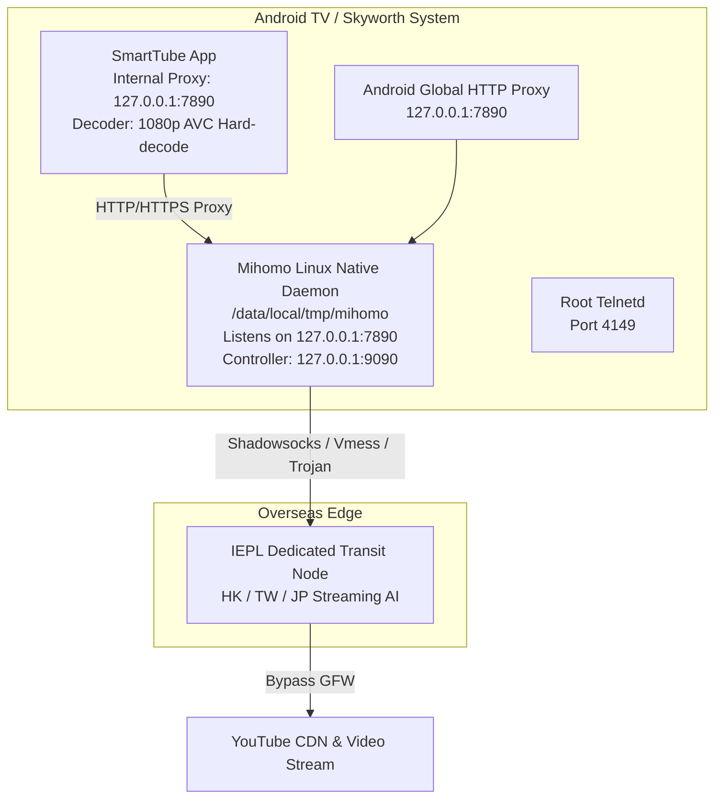

# Android TV YouTube (SmartTube) & Native Proxy Troubleshooting Skill

This skill provides a systematic diagnostic and troubleshooting methodology for running YouTube / SmartTube smoothly on Android TV devices in network environments requiring proxy/VPN. It addresses aggressive OEM process killers, Wi-Fi subnet changes, Windows Firewall blocking, internal SmartTube proxy configuration deadlocks, subscription link updating, and video decoder bottlenecks.

---

## 1. Core Architecture & Mental Model

### Why Standard GUI VPN Apps Fail on Android TV
* **OEM Aggressive Task Killers**: Android TV vendors (e.g., Skyworth `SkyRMS_Performance` / `DetectSys`, Coocaa, Xiaomi) aggressively kill background processes and accessibility services once GUI apps are minimized to the background.
* **VPN Service Teardown**: When a GUI VPN app (e.g., FlClash, v2rayNG, Clash for Android) is backgrounded, Android's `VpnService` session is forcibly terminated, breaking network access for SmartTube.
* **OOM Low-Memory Killer**: TV hardware typically has 1.5G~2G RAM. GUI apps consuming 200MB+ are killed immediately.

### The Robust Architecture: Linux Native Daemon + Local Proxy


---

## 2. Troubleshooting Matrix: Problems & Solutions

| Symptom / Error | Root Cause | Diagnosis & Verification | Solution |
| :--- | :--- | :--- | :--- |
| **`IllegalStateException: java.net.SocketTimeoutException: failed to connect to /<IP>:<PORT> after 20000ms`** | SmartTube internal preferences (`org.smarttube.stable_preferences.xml`) or Android Global Proxy is hardcoded to a stale/offline IP (e.g., old PC IP or old subnet). | Check `logcat` for `RetrofitHelper.java:127` or check `cat /data/data/org.smarttube.stable/shared_prefs/org.smarttube.stable_preferences.xml`. | Update `web_proxy_uri` to `http://127.0.0.1:7890` via root/ADB and run `settings put global http_proxy 127.0.0.1:7890`. |
| **TV Can Ping PC, ADB Works, But TV Cannot Connect to PC Proxy (SYN_SENT)** | Windows Defender Firewall drops inbound LAN connections on proxy ports (7897 / 7890) by default on Public/Private networks. | On TV: `toybox nc -w 3 <PC_IP> 7897` fails with timeout / `SYN_SENT` in `netstat`. | In Windows Firewall, allow `Clash Verge` & `verge-mihomo` for both Private and Public profiles, OR use local TV daemon on `127.0.0.1:7890`. |
| **Infinite Spinning / "转菊花" During Video Playback** | Video player is requesting 4K AV1 / VP9 formats that exceed the TV SoC's hardware decoder capabilities, forcing software decoding stall. | In player: Format shows 4K AV1 / VP9 and `AmlogicVideoDecoderAwesome: wait timeout 10ms`. | In SmartTube: Press Down $\rightarrow$ `HQ` $\rightarrow$ Video Preset $\rightarrow$ Lock to **`1080p 60fps AVC`** (or `1080p 30fps AVC`). |
| **Home Feed Loads, But Thumbnails are Blank/Dark** | 1. DNS poisoning from domestic upstream DNS (`redir-host` resolving fake IPs for `ytimg.com`).<br>2. Local image disk cache corruption during hard shutdowns. | Check thumbnail URLs: `curl https://i.ytimg.com/...` through proxy.<br>Check Mihomo DNS config. | In `/sdcard/mihomo/config.yaml`, ensure `https://dns.google/dns-query` or `1.1.1.1` is used, or switch to `fake-ip` mode. Clean cache if needed. |
| **Airport Subscription Changes / Node Expired** | Airport updates subscription URL or nodes expire. | Run `python scripts/update_subscription.py --url "<SUB_URL>"`. | Auto-downloads, injects TV parameters, hot-reloads Mihomo, and auto-selects the fastest node. |

---

## 3. Skyworth / Android TV ADB Operation & File Copy Guide

### 3.1 Pushing Binaries & Configurations to TV
```bash
# Push native binary to /data/local/tmp (executable)
adb push mihomo /data/local/tmp/mihomo
adb shell "chmod 755 /data/local/tmp/mihomo"

# Push configs to external storage
adb shell "mkdir -p /sdcard/mihomo"
adb push config.yaml /sdcard/mihomo/config.yaml
adb push Country.mmdb /sdcard/mihomo/Country.mmdb

# Start background daemon
adb shell "nohup /data/local/tmp/mihomo -d /sdcard/mihomo > /dev/null 2>&1 &"
```

### 3.2 Leanback TV UI Keycodes (DPAD vs Tap)
| Key | Keycode | Command |
| :--- | :--- | :--- |
| **DPAD UP** | 19 | `adb shell input keyevent 19` |
| **DPAD DOWN** | 20 | `adb shell input keyevent 20` |
| **DPAD LEFT** | 21 | `adb shell input keyevent 21` |
| **DPAD RIGHT** | 22 | `adb shell input keyevent 22` |
| **DPAD CENTER / ENTER** | 23 | `adb shell input keyevent 23` |
| **BACK** | 4 | `adb shell input keyevent 4` |

### 3.3 Root Access via Skyworth Built-in Telnetd (Port 4149)
Skyworth TVs run `busybox telnetd` on port `4149` as root:
```python
import socket
s = socket.socket()
s.connect(("192.168.0.116", 4149))
s.sendall(b"id\n") # Returns uid=0(root)
```

---

## 4. Key Scripts Reference

* `scripts/diag_tv.py`: Full end-to-end connectivity, ADB, port, and log diagnostic script.
* `scripts/update_subscription.py`: One-click subscription updater, TV optimizer, hot-reloader, and benchmark selector.
* `scripts/fix_smarttube_proxy.py`: Root-level automated XML preference updater for SmartTube.
* `scripts/smart_node_selector.py`: Automated benchmarking and fastest-node selector via Mihomo REST API.
