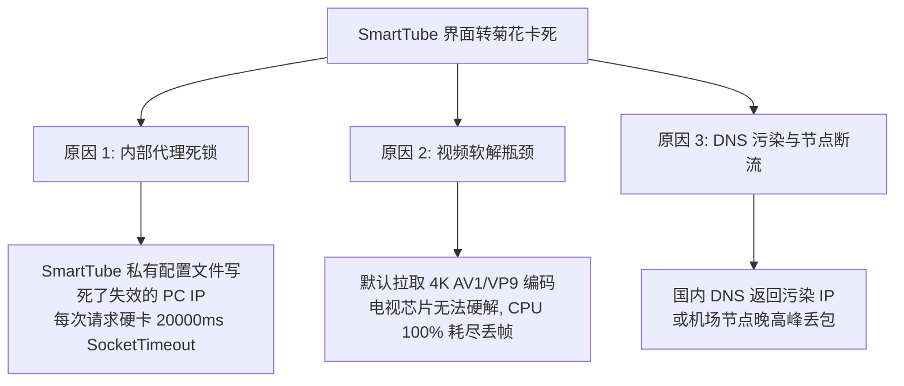
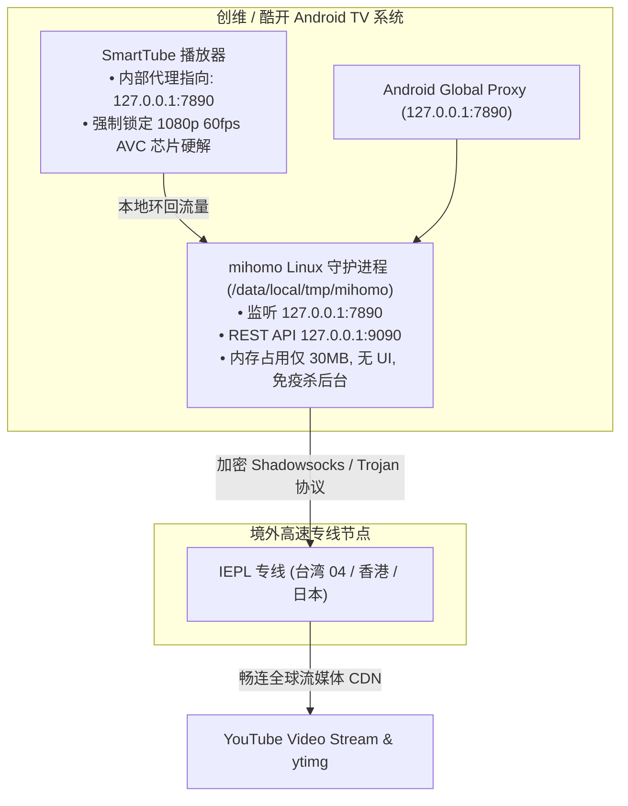

# Android TV YouTube (SmartTube) & Native Daemon Proxy Solution
### 🇨🇳 大陆普通安卓电视（创维/酷开/小米/索尼/TCL/海信）一键极速接入 YouTube 完整解决方案与排坑指南

[](https://github.com/Rouen007)
[](https://github.com/Rouen007)
[](https://github.com/Rouen007/android-tv-youtube-proxy-troubleshooting/releases)
[-green)](https://github.com/MetaCubeX/mihomo)
[](LICENSE)

本项目旨在彻底解决 **中国大陆地区普通安卓电视（无 Google 框架、厂商激进杀后台、遥控器难以操作 VPN、局域网共享代理频繁断流卡死）** 无法顺畅观看 YouTube 的行业痛点。

---

## 📺 演示与可视化控制面板

电视上的 Linux 原生代理守护进程启动后，开放了标准 REST API 控制接口（`9090`）。你可以在同一局域网的电脑或手机浏览器打开 Web 面板，实时查看电视连接的节点与网络流量：

```
http://yacd.metacubex.one/?hostname=<你的电视IP>&port=9090&secret=
```

---

## 📥 核心附件下载 (Release Downloads)

所有电视端所需的安装包与编译好的守护进程文件，均已打包上传至本仓库的 **[GitHub Releases 页面](https://github.com/Rouen007/android-tv-youtube-proxy-troubleshooting/releases/tag/v1.0.0)**：

| 附件文件 | 文件大小 | 说明 | 快速下载 |
| :--- | :--- | :--- | :--- |
| **`SmartTube_Stable.apk`** | ~34 MB | YouTube 电视端官方精简纯净版（无广告、支持芯片硬解、全中文） | [立即下载](https://github.com/Rouen007/android-tv-youtube-proxy-troubleshooting/releases/download/v1.0.0/SmartTube_Stable.apk) |
| **`mihomo`** | ~27 MB | 针对 Android TV (Linux ARM64/v7) 编译的底层常驻无头守护程序 | [立即下载](https://github.com/Rouen007/android-tv-youtube-proxy-troubleshooting/releases/download/v1.0.0/mihomo) |
| **`manage.py`** | - | 终端交互式全功能控制台（全自动部署 / 体检 / 测速 / 遥控） | [查看代码](./manage.py) |

---

## ⚡ 极速上手：交互式管理控制台 (`manage.py`)

只要电脑和电视连接在同一个 Wi-Fi 路由器下：

```bash
# 1. 克隆本项目
git clone https://github.com/Rouen007/android-tv-youtube-proxy-troubleshooting.git
cd android-tv-youtube-proxy-troubleshooting

# 2. 启动交互式控制台
python manage.py
```

### 🖥️ 终端控制台界面预览：
```text
======================================================================
  📺 Android TV YouTube & Native Proxy Daemon Manager
======================================================================

 当前目标电视 IP: <电视IP地址>

 [1] 🚀 一键全自动部署 (安装SmartTube + 部署后台守护进程 + 导入订阅)
 [2] 📡 电视环境一键全面体检 (检查ADB、Mihomo进程、API、YouTube连通性)
 [3] 🔄 一键更新机场订阅并热重载 (自动测速优选最快节点)
 [4] ⚡ 实时并发节点测速与智能优选 (将YouTube出口切换至极速专线)
 [5] 🛠️ 一键修复 SmartTube 代理死锁 (消除20秒超时卡死)
 [6] 📊 在浏览器中打开可视化控制面板 (Yacd Dashboard)
 [7] 🎮 电脑无线遥控器模式 (用电脑键盘控制电视)
 [0] ⚙️ 修改目标电视 IP 地址
 [q] 🚪 退出程序
```

> 💡 **部署完成后**：电视已具备完全独立的本地翻墙能力。**关闭电脑或手机，电视开机直接秒开 YouTube，完全脱离对电脑的依赖**！

---

## 📖 目录
- [1. 核心问题深度复盘 (Post-Mortem & Detours)](#1-核心问题深度复盘-post-mortem--detours)
  - [1.1 为什么 Android GUI 代理客户端走不通？](#11-为什么-android-gui-代理客户端走不通)
  - [1.2 导致“不定期卡死 / 持续转菊花”的三大隐藏元凶](#12-导致不定期卡死--持续转菊花的三大隐藏元凶)
  - [1.3 今天走过的弯路总结](#13-今天走过的弯路总结)
- [2. 电视 ADB 远程操作与文件传输实战](#2-电视-adb-远程操作与文件传输实战)
  - [2.1 如何开启电视的【ADB 调试】（各品牌差异与小红书搜索）](#21-如何开启电视的adb-调试各品牌差异与小红书搜索)
  - [2.2 远程如何把二进制与配置复制进电视？](#22-远程如何把二进制与配置复制进电视)
  - [2.3 Leanback TV 界面的 ADB 控制要点（遥控按键 vs 坐标点击）](#23-leanback-tv-界面的-adb-控制要点遥控按键-vs-坐标点击)
  - [2.4 创维/酷开 Root Telnet 调试通道 (端口 4149)](#24-创维酷开-root-telnet-调试通道-端口-4149)
- [3. 终极架构：Linux Native 守护进程 + 本地回环代理](#3-终极架构linux-native-守护进程--本地回环代理)
- [4. 自动化脚本工具箱详情](#4-自动化脚本工具箱详情)
- [5. SmartTube 最佳播放参数配置](#5-smarttube-最佳播放参数配置)

---

## 1. 核心问题深度复盘 (Post-Mortem & Detours)

### 1.1 为什么 Android GUI 代理客户端走不通？
很多用户第一反应是在电视上安装 **FlClash、v2rayNG、Clash for Android 或 Karing**：
* **OEM 强杀后台机制**：创维/酷开/小米等电视内置了激进的后台清理机制（如 `DetectSys` 和 `SkyRMS_Performance`）。只要你把 VPN 切换到后台并打开 SmartTube，系统会在 **2~5 秒内直接杀死 VPN 进程**。
* **VpnService 接口注销**：GUI 应用被杀死后，Android 系统的全局 VPN 接口立即被销毁注销，SmartTube 瞬间断网。
* **内存不足 OOM**：电视普遍只有 1.5G~2G 内存，GUI 类代理软件占用的 WebView / Flutter 渲染层动辄消耗 200MB+ 内存，极易被系统作为首要目标杀掉。

---

### 1.2 导致“不定期卡死 / 持续转菊花”的三大隐藏元凶



1. **SmartTube 内部配置写死 (20秒超时死锁)**：
   SmartTube 会在 `/data/data/org.smarttube.stable/shared_prefs/org.smarttube.stable_preferences.xml` 中将代理地址持久化。一旦网络或电脑 IP 变动，OkHttp/Retrofit 会对旧 IP 持续尝试连接，**每次阻塞 20 秒 (20000ms SocketTimeoutException)**，导致换台、刷新封面极慢。
2. **视频流软解导致 CPU 暴毙**：
   YouTube 默认提供 4K AV1 或 VP9 视频流。中低端电视芯片（如晶晨 Amlogic、联发科 MTK）缺乏 AV1 硬件解码单元，强行软解会导致 CPU 跑满、音画不同步甚至播放器死锁。
3. **国内 DNS 污染 `*.ytimg.com`**：
   在 `redir-host` 模式下如果上游 DNS 混入了国内 DNS，会导致缩略图封面请求被解析到虚假 IP，封面变成空白灰块。

---

### 1.3 今天走过的弯路总结
* ❌ **弯路 1：依赖局域网电脑代理（Clash Verge）**
  - **问题**：电脑休眠、Wi-Fi 切换（如由 5G 切回 2.4G 导致电脑 IP 变动），以及 Windows Defender 防火墙默认拦截局域网入站连接（TCP SYN 丢弃），电视端直接彻底瘫痪。
  - **正解**：电视端必须运行独立的本地后台进程，实现 **“零电脑依赖、开机自启”**。
* ❌ **弯路 2：尝试在电视安装安卓版客户端（FlClash）**
  - **问题**：安装后在电视遥控器上极难操作，且一旦切到 SmartTube 后台立刻被系统杀进程。
  - **正解**：摒弃 Android App 形式，直接将编译好的 **Linux 命令行二进制程序 (`mihomo`)** 放入 `/data/local/tmp` 作为 Linux 常驻守护进程运行。
* ❌ **弯路 3：只修改系统全局代理，未清除 SmartTube 自身代理缓存**
  - **问题**：通过 ADB 设置了 `settings put global http_proxy`，但 SmartTube 应用内部依旧优先读取自身的 `web_proxy_uri`，导致报错依旧。
  - **正解**：通过 Root Telnet 直接用 `sed` 修改 SmartTube 内部首选项 XML 文件。

---

## 2. 电视 ADB 远程操作与文件传输实战

### 2.1 如何开启电视的【ADB 调试】（各品牌差异与小红书搜索）

不同品牌的安卓电视（创维、小米、海信、TCL、索尼、长虹、华为等）开启 ADB 调试的暗码与工厂菜单路径各不相同：

> 💡 **最简单的方法**：打开 **小红书** 或 **B站**，直接搜索 `“你的电视品牌 + 开启ADB”`（例如：`创维电视 开启ADB调试`、`小米电视 开启开发者模式`），跟着图文或短视频操作只需 1 分钟。

#### 常见主流品牌开启方式速查：
* **创维 / 酷开 (Skyworth / Coocaa)**：
  - 进入【设置】 $\rightarrow$ 【关于/系统信息】 $\rightarrow$ 在【本机信息】上连续按遥控器【上方向键】（或在“系统版本号”连按 5 次确定） $\rightarrow$ 弹出工厂菜单 $\rightarrow$ 开启【ADB 调试】或【通用调试】。
* **小米 / Redmi 电视**：
  - 【设置】 $\rightarrow$ 【关于】 $\rightarrow$ 在【产品型号】上连续按 OK 键 5 次提示开启开发者模式 $\rightarrow$ 返回【账号与安全】 $\rightarrow$ 将【ADB 调试】改为【允许】。
* **索尼电视 (Sony Bravia)**：
  - 【设置】 $\rightarrow$ 【系统/设备偏好设置】 $\rightarrow$ 【关于】 $\rightarrow$ 连续点击【内部版本号】 7 次 $\rightarrow$ 返回在【开发者选项】中打开【USB 调试 / 网络 ADB】。
* **海信 / 华为 / TCL / 长虹**：
  - 建议直接在小红书搜索型号对应暗码进入工厂菜单开启。

电脑端连接命令：
```bash
adb connect <电视IP地址>:5555
adb devices
```

---

### 2.2 远程如何把二进制与配置复制进电视？
Android TV 的很多目录（如 `/system`）是只读的，且普通权限无法直接向 `/data/data/` 写入文件。

#### ① 推送核心守护程序
`/data/local/tmp` 具有执行权限，是存放 Linux 原生二进制文件的最佳位置：
```bash
# 1. 推送 mihomo 核心
adb push mihomo /data/local/tmp/mihomo
adb shell "chmod 755 /data/local/tmp/mihomo"

# 2. 推送配置文件与 GeoIP 数据库到外置存储
adb shell "mkdir -p /sdcard/mihomo"
adb push config.yaml /sdcard/mihomo/config.yaml
adb push Country.mmdb /sdcard/mihomo/Country.mmdb
```

#### ② 启动并常驻后台
通过 `nohup` 让进程脱离终端会话运行：
```bash
adb shell "nohup /data/local/tmp/mihomo -d /sdcard/mihomo > /dev/null 2>&1 &"
```

---

### 2.3 Leanback TV 界面的 ADB 控制要点（遥控按键 vs 坐标点击）
> ⚠️ **注意**：Android TV 的 Leanback 架构下，`input tap x y` 往往不能改变焦点或进入子菜单，**必须使用标准 DPAD 键值**：

| 按键动作 | Android Keycode | ADB 命令 |
| :--- | :--- | :--- |
| **方向上 (UP)** | 19 | `adb shell input keyevent 19` |
| **方向下 (DOWN)** | 20 | `adb shell input keyevent 20` |
| **方向左 (LEFT)** | 21 | `adb shell input keyevent 21` |
| **方向右 (RIGHT)** | 22 | `adb shell input keyevent 22` |
| **确定 / 播放 (OK / ENTER)** | 23 / 66 | `adb shell input keyevent 23` |
| **返回 (BACK)** | 4 | `adb shell input keyevent 4` |
| **主页 (HOME)** | 3 | `adb shell input keyevent 3` |

---

### 2.4 创维/酷开 Root Telnet 调试通道 (端口 4149)
创维电视系统通常内置了 `busybox telnetd` 调试守护进程（运行在 `4149` 端口，拥有 `uid=0 (root)` 权限）：
```python
import socket

s = socket.socket()
s.connect(("<电视IP地址>", 4149)) # 创维电视 root telnet
s.sendall(b"id\n")
print(s.recv(1024)) # uid=0(root) gid=0(root)
```

---

## 3. 终极架构：Linux Native 守护进程 + 本地回环代理



---

## 4. 自动化脚本工具箱详情

| 脚本文件 | 功能说明 | 独立执行命令 |
| :--- | :--- | :--- |
| **`manage.py`** | 统一终端可视化管理控制台（推荐） | `python manage.py` |
| **`setup_tv.py`** | 大陆安卓电视一键部署全套环境（APK安装 + 二进制部署 + 订阅注入） | `python scripts/setup_tv.py --tv-ip <IP> --sub-url "<URL>"` |
| **`update_subscription.py`** | 一键更新机场订阅链接并热重载 | `python scripts/update_subscription.py --tv-ip <IP> --url "<URL>"` |
| **`fix_smarttube_proxy.py`** | 一键修复 SmartTube 内部代理死锁 | `python scripts/fix_smarttube_proxy.py --tv-ip <IP>` |
| **`smart_node_selector.py`** | 全自动多节点并发测速并优选 | `python scripts/smart_node_selector.py --tv-ip <IP>` |
| **`diag_tv.py`** | 电视端环境与连通性全面诊断 | `python scripts/diag_tv.py --tv-ip <IP>` |

---

## 5. SmartTube 最佳播放参数配置

为了保证长期稳定流畅播放，请在电视上保持以下配置：
1. **画质与解码格式**：播放任意视频 $\rightarrow$ 遥控器下键 $\rightarrow$ `HQ (播放品質設定)` $\rightarrow$ `影片預設` $\rightarrow$ 勾选 **`1080p 60fps AVC`**。
2. **缓冲区**：`設定` $\rightarrow$ `播放器設定` $\rightarrow$ `緩衝區大小` $\rightarrow$ 改为 **`High (高)`**。
3. **广告过滤**：`設定` $\rightarrow$ `SponsorBlock` $\rightarrow$ 打开 **`啟用`**（自动跳过片头和恰饭口播）。

---

## 📄 License
MIT License. Created by [Rouen007](https://github.com/Rouen007).
