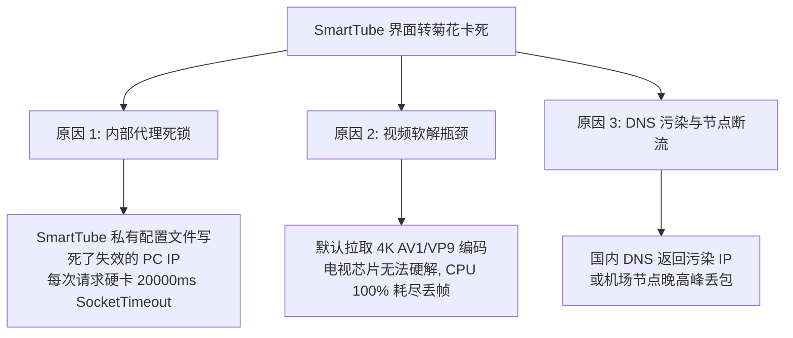
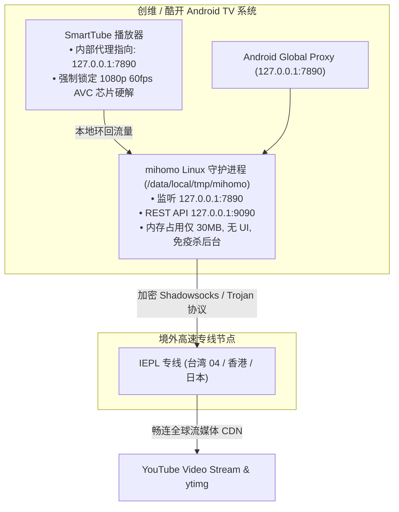

# Android TV YouTube (SmartTube) & Native Daemon Proxy Troubleshooting Guide

[](https://github.com/Rouen007)
[](https://github.com/Rouen007)
[](https://github.com/yuliskov/SmartTube)
[-green)](https://github.com/MetaCubeX/mihomo)
[](LICENSE)

A battle-tested architectural blueprint, diagnostic runbook, and automation toolset for running **YouTube (SmartTube)** with maximum stability on locked-down Android TV systems (Skyworth 创维, Coocaa 酷开, Xiaomi, Sony, TCL).

---

## 📖 Table of Contents
- [1. 核心问题深度复盘 (Post-Mortem & Detours)](#1-核心问题深度复盘-post-mortem--detours)
  - [1.1 为什么 Android GUI 代理客户端走不通？](#11-为什么-android-gui-代理客户端走不通)
  - [1.2 导致“不定期卡死 / 持续转菊花”的三大隐藏元凶](#12-导致不定期卡死--持续转菊花的三大隐藏元凶)
  - [1.3 今天走过的弯路总结](#13-今天走过的弯路总结)
- [2. 创维电视 ADB 远程操作与文件传输实战](#2-创维电视-adb-远程操作与文件传输实战)
  - [2.1 创维电视开启 ADB 调试](#21-创维电视开启-adb-调试)
  - [2.2 远程如何把二进制与配置复制进电视？](#22-远程如何把二进制与配置复制进电视)
  - [2.3 Leanback TV 界面的 ADB 控制要点（遥控按键 vs 坐标点击）](#23-leanback-tv-界面的-adb-控制要点遥控按键-vs-坐标点击)
  - [2.4 获取 Root 权限与 Telnet 后门 (端口 4149)](#24-获取-root-权限与-telnet-后门-端口-4149)
- [3. 终极架构：Linux Native 守护进程 + 本地回环代理](#3-终极架构linux-native-守护进程--本地回环代理)
- [4. 自动化脚本工具箱](#4-自动化脚本工具箱)
  - [4.1 一键更新机场订阅与热重载 (`update_subscription.py`)](#41-一键更新机场订阅与热重载-update_subscriptionpy)
  - [4.2 一键修复 SmartTube 内部代理死锁 (`fix_smarttube_proxy.py`)](#42-一键修复-smarttube-内部代理死锁-fix_smarttube_proxypy)
  - [4.3 全自动多节点测速与优选 (`smart_node_selector.py`)](#43-全自动多节点测速与优选-smart_node_selectorpy)
  - [4.4 电视环境一键诊断 (`diag_tv.py`)](#44-电视环境一键诊断-diag_tvpy)
- [5. SmartTube 最佳播放参数配置](#5-smarttube-最佳播放参数配置)

---

## 1. 核心问题深度复盘 (Post-Mortem & Detours)

### 1.1 为什么 Android GUI 代理客户端走不通？
很多用户第一反应是在电视上安装 **FlClash、v2rayNG、Clash for Android 或 Karing**：
* **OEM 强杀后台机制**：创维/酷开电视内置了激进的性能守护程序（`DetectSys` 和 `SkyRMS_Performance`），只要你把 VPN 应用切到后台并打开 SmartTube，系统会在 **2~5 秒内直接杀掉 VPN 进程**。
* **VpnService 接口被撤回**：GUI 应用被杀死后，Android 系统的全局 VPN 通道立即被注销，SmartTube 瞬间断网。
* **内存不足 OOM**：电视普遍只有 1.5G~2G 内存，GUI 类代理软件占用的 WebView / Flutter 渲染层动辄消耗 200MB+ 内存，极易被系统低内存杀手（LMK）作为首要目标击杀。

---

### 1.2 导致“不定期卡死 / 持续转菊花”的三大隐藏元凶
在解决过程中，我们发现表面上都是“转菊花”，但背后其实有 3 个完全不同的致命原因：



1. **SmartTube 内部配置写死 (20秒超时死锁)**：
   SmartTube 在 `/data/data/org.smarttube.stable/shared_prefs/org.smarttube.stable_preferences.xml` 中将代理地址死死持久化。一旦网络或电脑 IP 变动，OkHttp/Retrofit 会对旧 IP 持续尝试连接，**每次阻塞 20 秒 (20000ms SocketTimeoutException)**，导致换台、刷新封面极慢。
2. **视频流软解导致 CPU 暴毙**：
   YouTube 默认提供 4K AV1 或 VP9 视频流。中低端电视芯片（如晶晨 Amlogic、联发科 MTK）缺乏 AV1 硬件解码单元，强行软解会导致 CPU 跑满、音画不同步甚至播放器死锁。
3. **国内 DNS 污染 `*.ytimg.com`**：
   在 `redir-host` 模式下如果上游 DNS 混入了国内 DNS，会导致缩略图封面请求被解析到虚假 IP，封面变成空白灰块。

---

### 1.3 今天走过的弯路总结
* ❌ **弯路 1：依赖局域网电脑代理（Clash Verge）**
  - **问题**：电脑休眠、Wi-Fi 切换（如由 5G 切回 2.4G 导致电脑 IP 从 `192.168.28.253` 变成 `192.168.0.114`），以及 Windows Defender 防火墙默认拦截局域网入站连接（TCP SYN 丢弃），电视端直接彻底瘫痪。
  - **正解**：电视端必须运行独立的本地后台进程，实现 **“零电脑依赖、开机自启”**。
* ❌ **弯路 2：尝试在电视安装安卓版客户端（FlClash）**
  - **问题**：安装后在电视遥控器上极难操作，且一旦切到 SmartTube 后台立刻被创维系统杀进程。
  - **正解**：摒弃 Android App 形式，直接将编译好的 **Linux 命令行二进制程序 (`mihomo`)** 放入 `/data/local/tmp` 作为 Linux 常驻守护进程运行。
* ❌ **弯路 3：只修改系统全局代理，未清除 SmartTube 自身代理缓存**
  - **问题**：通过 ADB 设置了 `settings put global http_proxy`，但 SmartTube 应用内部依旧优先读取自身的 `web_proxy_uri`，导致报错依旧。
  - **正解**：通过 Root Telnet 直接用 `sed` 修改 SmartTube 内部首选项 XML 文件。

---

## 2. 创维电视 ADB 远程操作与文件传输实战

### 2.1 创维电视开启 ADB 调试
1. 进入电视【设置】 $\rightarrow$ 【关于/系统信息】。
2. 在【本机信息】连续按遥控器上按键（或在“版本号”连按 5 次确定）进入工厂菜单 / 开发者选项。
3. 找到 **【ADB 调试】**（或【通用调试】），先关掉再重新打开一次（刷新监听端口 `5555`）。
4. 电脑端连接：
   ```bash
   adb connect 192.168.0.116:5555
   adb devices
   ```

---

### 2.2 远程如何把二进制与配置复制进电视？
Android TV 的很多目录（如 `/system`）是只读的，且普通权限无法直接向 `/data/data/` 写入文件。

#### ① 推送核心守护程序
`/data/local/tmp` 具有执行权限，是存放 Linux 原生二进制文件的最佳位置：
```bash
# 1. 推送 mihomo 核心
adb push mihomo /data/local/tmp/mihomo
adb shell "chmod 755 /data/local/tmp/mihomo"

# 2. 推送配置文件与 GeoIP 数据库到外置存储
adb shell "mkdir -p /sdcard/mihomo"
adb push config.yaml /sdcard/mihomo/config.yaml
adb push Country.mmdb /sdcard/mihomo/Country.mmdb
```

#### ② 启动并常驻后台
通过 `nohup` 让进程脱离终端会话运行：
```bash
adb shell "nohup /data/local/tmp/mihomo -d /sdcard/mihomo > /dev/null 2>&1 &"
```

---

### 2.3 Leanback TV 界面的 ADB 控制要点（遥控按键 vs 坐标点击）
> ⚠️ **注意**：Android TV 的 Leanback 架构下，`input tap x y` 往往不能改变焦点或进入子菜单，**必须使用标准 DPAD 键值**：

| 按键动作 | Android Keycode | ADB 命令 |
| :--- | :--- | :--- |
| **方向上 (UP)** | 19 | `adb shell input keyevent 19` |
| **方向下 (DOWN)** | 20 | `adb shell input keyevent 20` |
| **方向左 (LEFT)** | 21 | `adb shell input keyevent 21` |
| **方向右 (RIGHT)** | 22 | `adb shell input keyevent 22` |
| **确定 / 播放 (OK / ENTER)** | 23 / 66 | `adb shell input keyevent 23` |
| **返回 (BACK)** | 4 | `adb shell input keyevent 4` |
| **主页 (HOME)** | 3 | `adb shell input keyevent 3` |
| **删除字符 (DEL)** | 67 | `adb shell input keyevent 67` |
| **文本输入** | - | `adb shell input text "<your_text>"` |

---

### 2.4 获取 Root 权限与 Telnet 后门 (端口 4149)
创维电视系统通常内置了 `busybox telnetd` 调试守护进程（运行在 `4149` 端口，拥有 `uid=0 (root)` 权限）：
```python
import socket

s = socket.socket()
s.connect(("192.168.0.116", 4149)) # 创维电视 root telnet
s.sendall(b"id\n")
print(s.recv(1024)) # uid=0(root) gid=0(root)
```
利用此通道可以直接读写任意系统受保护的应用数据目录（如 `/data/data/org.smarttube.stable/`）。

---

## 3. 终极架构：Linux Native 守护进程 + 本地回环代理



---

## 4. 自动化脚本工具箱

### 4.1 一键更新机场订阅与热重载 (`update_subscription.py`)
无需重启电视，自动拉取订阅、注入电视低内存参数、推送到电视并热更新，随后自动并发测速并绑定最快节点：
```bash
python scripts/update_subscription.py --tv-ip 192.168.0.116 --url "https://your-airport.com/api/v1/client/subscribe?token=xxxx"
```

### 4.2 一键修复 SmartTube 内部代理死锁 (`fix_smarttube_proxy.py`)
通过 Root 权限直接更新 SmartTube 内部首选项 XML 文件并重启应用：
```bash
python scripts/fix_smarttube_proxy.py --tv-ip 192.168.0.116
```

### 4.3 全自动多节点测速与优选 (`smart_node_selector.py`)
通过 Mihomo REST API 对所有专线节点进行毫秒级测速，并将 `Proxy` 组切换到当前最快节点：
```bash
python scripts/smart_node_selector.py --tv-ip 192.168.0.116
```

### 4.4 电视环境一键诊断 (`diag_tv.py`)
全面检测 ADB 连通性、后台进程状态、API 端口及 YouTube 连通性：
```bash
python scripts/diag_tv.py --tv-ip 192.168.0.116
```

---

## 5. SmartTube 最佳播放参数配置

为了保证长期稳定流畅播放，请在电视上保持以下配置：
1. **画质与解码格式**：播放任意视频 $\rightarrow$ 遥控器下键 $\rightarrow$ `HQ (播放品質設定)` $\rightarrow$ `影片預設` $\rightarrow$ 勾选 **`1080p 60fps AVC`**。
2. **缓冲区**：`設定` $\rightarrow$ `播放器設定` $\rightarrow$ `緩衝區大小` $\rightarrow$ 改为 **`High (高)`**。
3. **广告过滤**：`設定` $\rightarrow$ `SponsorBlock` $\rightarrow$ 打开 **`啟用`**（自动跳过片头和恰饭口播）。

---

## 📄 License
MIT License. Created by [Rouen007](https://github.com/Rouen007).
